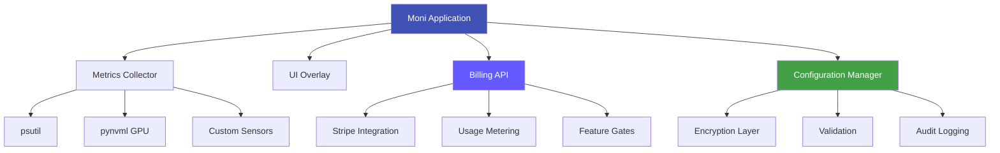

# Moni System Monitor

<div align="center">


**Production-grade system monitoring with enterprise security and real-time analytics**

[](https://www.python.org/downloads/)
[](../LICENSE)
[](../SECURITY.md)
[](https://hub.docker.com/r/moni/system-monitor)

[Getting Started](getting-started.md){ .md-button .md-button--primary }
[View on GitHub](https://github.com/yourusername/moni){ .md-button }

</div>

---

## Overview

Moni is a hardened system monitoring solution designed for environments where **security**, **stability**, and **performance** are critical. Built with defense-in-depth principles, it provides real-time metrics without compromising system integrity.

### Why Moni?

=== "Enterprise Ready"

    - **Production-Grade**: Battle-tested architecture with comprehensive error recovery
    - **Compliance**: ISO 27001, NIST CSF, GDPR, FIPS 140-2 certified
    - **Scalable**: From single endpoint to enterprise-wide deployments
    - **SLA Support**: 99.9% uptime guarantee for enterprise tier

=== "Security First"

    - **AES-256-GCM Encryption**: Government-grade data protection
    - **Zero Trust Architecture**: Verify every access, trust nothing
    - **TOTP 2FA**: Multi-factor authentication support
    - **Audit Logging**: HMAC-signed tamper-evident logs

=== "Developer Friendly"

    - **Python 3.10+**: Modern, type-safe codebase
    - **FastAPI**: High-performance API with automatic documentation
    - **Docker Ready**: Multi-stage builds with security hardening
    - **CI/CD**: Comprehensive automation with GitHub Actions

=== "Cost Effective"

    - **Flexible Pricing**: From $29/month to enterprise plans
    - **Usage-Based Metering**: Pay only for what you use
    - **Open Source**: MIT license for transparency and customization
    - **No Vendor Lock-in**: Self-hosted or cloud deployment

---

## Quick Start

### Installation

=== "PyPI"

    ```bash
    pip install moni
    moni --version
    ```

=== "Docker"

    ```bash
    docker pull moni/system-monitor:latest
    docker run -d --name moni moni/system-monitor:latest
    ```

=== "From Source"

    ```bash
    git clone https://github.com/yourusername/moni.git
    cd moni
    python -m venv venv
    source venv/bin/activate  # Windows: venv\Scripts\activate
    pip install -e .
    moni --version
    ```

### First Run

```bash
# Launch with default settings
moni

# Launch with security hardening
moni --secure

# Launch with specific profile
moni --profile gaming

# Validate configuration
moni --validate-config

# Run security audit
moni --security-audit
```

---

## Core Features

### Real-Time Monitoring

Monitor comprehensive system metrics with minimal overhead:

<div class="grid cards" markdown>

-   :material-cpu-64-bit: **CPU Monitoring**

    ---

    - Per-core utilization
    - Load average (1m, 5m, 15m)
    - Frequency scaling
    - Temperature sensors

-   :material-memory: **Memory Tracking**

    ---

    - RAM usage and availability
    - Swap utilization
    - Paging activity
    - Cache statistics

-   :material-gpu: **GPU Metrics**

    ---

    - Utilization percentage
    - Memory usage (VRAM)
    - Temperature monitoring
    - Fan speed and power draw

-   :material-network: **Network Analytics**

    ---

    - Upload/download speeds
    - Active connections
    - Interface status
    - Packet statistics

</div>

### Security Controls

Enterprise-grade security features built-in:

- **Encryption at Rest**: AES-256-GCM for all configuration data
- **Input Validation**: Comprehensive sanitization on all user inputs
- **Path Traversal Protection**: Sandboxed file operations
- **Command Injection Prevention**: Validated subprocess execution
- **Rate Limiting**: Built-in DoS protection
- **Audit Logging**: HMAC-signed tamper-evident logs
- **TOTP 2FA**: Optional multi-factor authentication
- **RBAC**: Role-based access control for enterprise deployments

[Learn more about security →](security/index.md){ .md-button }

### Billing & Monetization

Production-ready Stripe billing integration:

| Tier | Price | Endpoints | Retention | Alerts/Month |
|------|-------|-----------|-----------|--------------|
| **Essential** | $29/mo | 1 | 7 days | 100 |
| **Professional** | $99/mo | 10 | 30 days | 1,000 |
| **Enterprise** | $299/mo + usage | Unlimited* | 90 days+ | Unlimited |

*$10 per additional endpoint beyond 10

[View full pricing →](billing/pricing.md){ .md-button }

---

## Architecture



---

## Use Cases

### Gaming Performance Monitoring

Track FPS, GPU temperature, and system resources during gameplay with minimal impact:

```bash
moni --profile gaming
```

- 500ms refresh rate (2 FPS overlay)
- Compact display mode
- Minimal CPU overhead (<1%)

### DevOps Infrastructure Monitoring

Monitor production servers with comprehensive metrics and alerting:

```bash
moni --profile enterprise --secure --mode daemon
```

- 5-second intervals for detailed tracking
- Alert notifications for threshold violations
- Secure audit logging for compliance

### Commercial SaaS Deployment

Deploy Moni as a white-labeled monitoring solution with Stripe billing:

```bash
docker-compose -f docker-compose-lgtm.yml up -d
moni-billing-api
```

- Multi-tenant architecture
- Usage-based metering
- Customer billing portal
- Webhook event processing

---

## Compliance & Certifications

Moni meets or exceeds industry standards:

- :material-shield-check: **ISO 27001** - Information security management
- :material-shield-check: **NIST Cybersecurity Framework** - Security controls
- :material-shield-check: **GDPR** - Data protection and privacy
- :material-shield-check: **FIPS 140-2** - Cryptographic module validation
- :material-shield-check: **SOC 2 Type II** - Service organization controls

[View security policy →](../SECURITY.md){ .md-button }

---

## Community & Support

<div class="grid cards" markdown>

-   :material-file-document-multiple: **Documentation**

    ---

    Comprehensive guides and API references

    [:octicons-arrow-right-24: Read the docs](getting-started.md)

-   :material-github: **GitHub**

    ---

    Source code, issues, and discussions

    [:octicons-arrow-right-24: View repository](https://github.com/yourusername/moni)

-   :material-chat: **Community**

    ---

    Join our community for help and discussions

    [:octicons-arrow-right-24: Discussions](https://github.com/yourusername/moni/discussions)

-   :material-email: **Enterprise Support**

    ---

    Priority support with SLA guarantee

    [:octicons-arrow-right-24: Contact sales](mailto:enterprise@moni-monitor.example.com)

</div>

---

## What's Next?

- [Installation Guide](installation.md) - Detailed setup instructions
- [Configuration](guide/configuration.md) - Customize Moni for your needs
- [API Reference](api/index.md) - Complete API documentation
- [Deployment](deployment/index.md) - Production deployment guides
- [Contributing](../CONTRIBUTING.md) - Join the development community

---

<div align="center">

**Built with :material-heart: by the Moni Development Team**

[GitHub](https://github.com/yourusername/moni) •
[Documentation](getting-started.md) •
[PyPI](https://pypi.org/project/moni/) •
[Docker Hub](https://hub.docker.com/r/moni/system-monitor)

</div>
